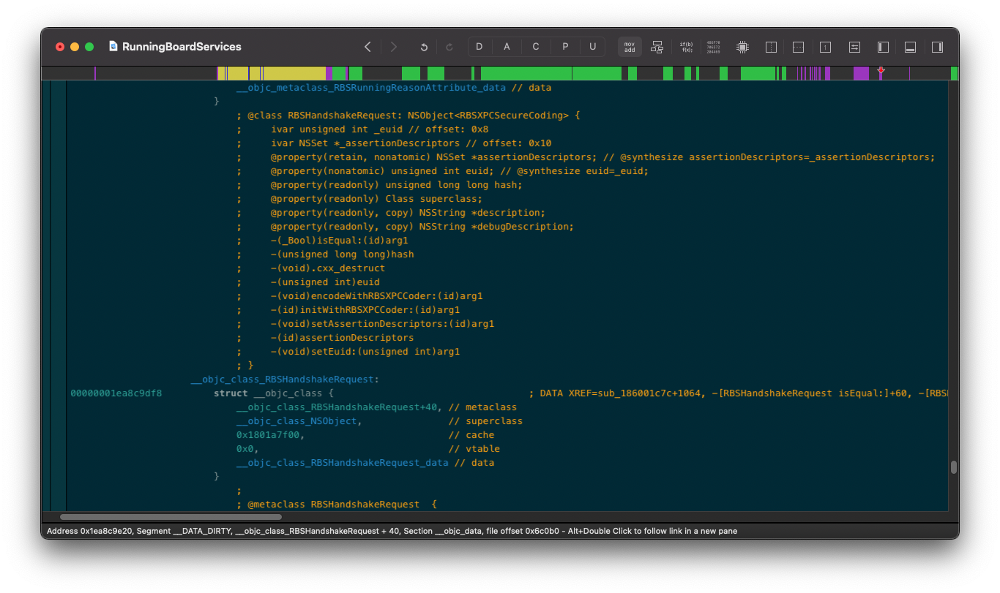
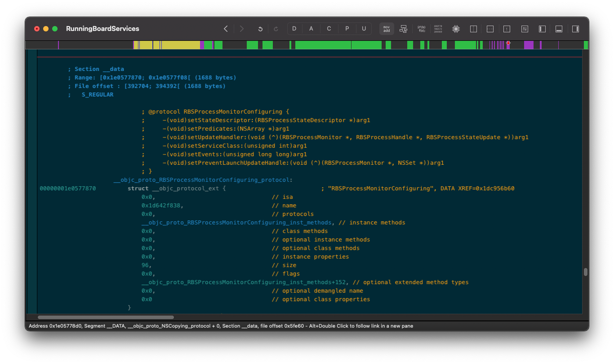

# dsctool
Hopper plugin to analyze ObjC runtime structures in the dyld_shared_cache: reconstruct class and protocol structures with the name & type information of ivars, properties, methods, and superclasses.

This is accomplished through:
1) de-authenticating pointers & importing data from the dsc with private Hopper methods (exposed via extended headers, hence the need to bundle the SDK with the tool)
2) statically linking Steve Nygard's awesome class-dump library (hence the submodule)
3) a bit of parsing of the [new Objective-C runtime structures](https://opensource.apple.com/source/objc4/objc4-818.2/runtime/objc-runtime-new.h.auto.html)

### Class reconstruction:

### Protocol reconstruction:

## How to build
1. Define or change `PLATFORM_IOSMAC` to 6 in `class-dump/Source/CDLCBuildVersion.m` (known issue: https://github.com/nygard/class-dump/issues/93)
2. Configure your development signing certificate under Signing & Capabilities (otherwise the plugin won't load)
3. Build the plugin and copy `DSCTool.hopperTool/` to `~/Library/Application Support/Hopper/PlugIns/v4/Tools/`

## Usage
Note that the plugin is intended to be used on individual frameworks in the Big Sur dyld_shared_cache. I use it personally on M1 and have not tested it on an Intel Mac or iOS though I don't anticipate any issues.

The plugin exposes four menus under Tool Plugins:
- Analyze address at cursor as __objc_class: this will dereference the address at the current cursor (making sure to dePAC & import, if necessary) then parse the destination as a class, along with all of its relevant fields. Taking care to dePAC, if the pointer is authenticated, and import if the data is unmapped.
- Analyze address at cursor as __objc_protocol
- Analyze all classes in __objc_classlist
- Analyze all protocols in __objc_protolist

## Known Issues
- Sometimes you have to analyze a class twice for it work... 🤷‍♂️
